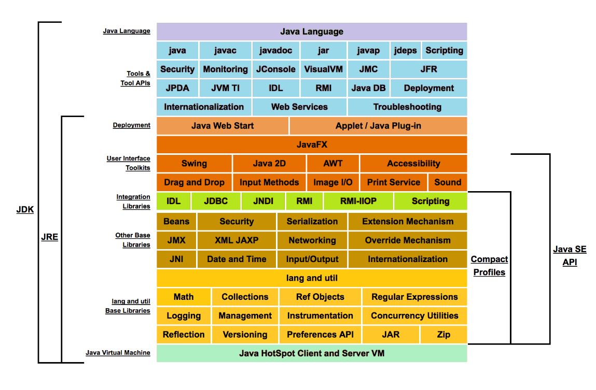
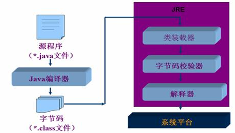
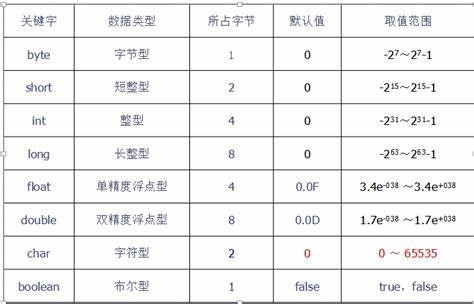
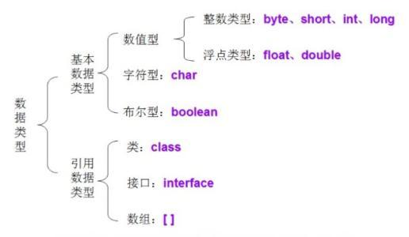
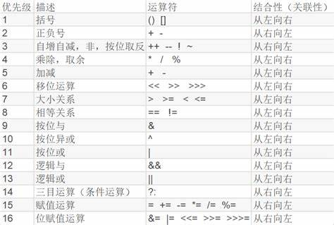

# Java

## Java的特性和优势

### 简单性

### 面向对象

### 可移植性

跨平台，写一次，运行多次

write once， run anywhere

### 高性能

### 分布式

### 动态性

### 多线程

### 安全性

### 健壮性

## JDK  JRE  JVM



安装，配置环境变量等

## Java程序的运行机制

### 编译型

直接将源代码文件翻译成为机器可识别的语言，例如C/C++

### 解释型

边执行边解释，例如JavaScript等

Java即包含编译型有包含解释型

### 程序运行机制



预编译成为字节码文件，然后再将字节码文件放入JVM进行解释，最终执行在系统平台上


## Java基础语法

### 注释、标识符、关键字

注释并不会被执行，是给开发者看的。**编写注释是一个好习惯**

#### 单行注释

``` java
// 这是单行注释
```

#### 多行注释

```java
/*
这是多行注释
这是多行注释
*/
```

#### 文档注释

``` java
/**
 * 这是文档注释
 * @Author huhusw
 * @Date 2020/11/3
 */
```

#### 标识符

所有的标识符需要以字母、美元符、下划线开头

首字母之后可以是字母、数字、下划线、和任意字符组成

不能使用关键字作为标识符

**大小写敏感**

#### 关键字


### 数据类型

#### 强类型语言

Java是强类型语言，严格符合固定，先定义，再使用

安全性较高，速度相对较慢

#### 弱类型语言

JS、VB等

#### 基本类型



> ***进制***

> ***浮点数表示***


#### 引用类型



### 类型转换

不同类型数据进行计算时，需要转换为相同类型，方式有自动类型转换和强制类型转换

### 变量、常量

Java变量是程序中最基本的存储单元，包括变量名，变量类型和作用域

```java
int a = 0;
```

常量名一般使用全部大写字母，使用final修饰

```java
static final double PI = 3.14;
```

**命名规则**

类成员变量：首字母小写和驼峰原则

局部变量：首字母小写和驼峰原则

变量：大写字母和下划线

类名：首字母大写和驼峰原则

方法名：首字母小写和驼峰原则

#### 作用域

类变量

实例变量，从属于对象

局部变量，必须声明和初始化值

```java
public class HelloWorld {
    // 实例变量
    int age;
    String name;

    // 类变量
    static int s;

    public static void main(String[] args) {
        // 局部变量，必须声明和初始化值
        int a = 0;

        //使用实例变量
        HelloWorld helloWorld = new HelloWorld();
        System.out.println(helloWorld.age);

        // 使用类变量
        System.out.println(HelloWorld.s);
    }
}
```


### 运算符



### 包机制、JavaDoc

# Java流程控制

## 用户交互Scanner对象

```java
// 定义scnner对象
Scanner scanner = new Scanner(System.in);
if (scanner.hasNext()) {
    // 获取下一个输入的字符串，回车结束
    String next = scanner.next();
}
// 不使用时关闭此对象
scanner.close();
```

## 顺序结构

最简单的结构，一句一句进行执行

## 选择结构

if和switch

## 循环结构

while、for、dowhile

增强for循环

```java
for(生命语句:表达式){
    // 代码语句
}
```

## break和continue

循环控制语句

# Java方法（函数）

## 什么是方法

是语句的集合，在一起执行一个功能，包含于类或者对象中，在程序中创建，在其他地方被引用

方法的功能尽可能单一，保持原子性

## 方法的定义和调用

类似于其他语言的函数，是完成特定功能的代码片段。

方法包含一个方法体和方法头：修饰符、返回值类型、方法名、参数类型（形参和实参）、方法体、返回值

适用对象进行调用

Java使用的是值传递，没有引用传递

## 方法重载

方法名称必须相同，参数列表必须不同（参数个数、参数顺序、参数类型不同）

返回值类型可以相同

## 命令行传参

直接传递给main方法

## 可变参数

传递同类型的可变参数给方法

```java
//可变参数
public void add(int... arr){

}
```

可变参数必须放在参数列表的最后，每一个方法只能接受一个可变参数

## 递归

自己调用自己，将大型原问题分解为与原问题相同小问题进行解决

# 数组

## 数组概述

相同类型数据的有序集合，其中每个数据称为一个数组元素，可以通过下标进行访问

## 数组声明和创建

```java
// 声明数组，创建了一个10个元素的数组，推荐
int[] arr1 = new int[10];
// 声明数组，创建了一个10个元素的数组，不推荐，c/c++风格
int arr2[] = new int[10];
```

初始化

```java
// 静态初始化，创建和赋值
int[] array1 = {1,2,1,2,1,2,5,1};
// 动态初始化，赋值在别处
int[] array2 = new int[10];
```

数组的长度是确定的，一旦创建，大小是不能改变的

数组中的元素必须是相同类型的

数组中的元素可以是任何数据类型，包括引用类型和基本类型

数组是引用类型，可以当做对象来处理，存储在堆中

## 数组使用

### for-each循环

增强for循环可以直接操作数组

```java
int[] array1 = {1, 2, 1, 2, 1, 2, 5, 1};
for (int num : array1) {
	System.out.println(num);
}
```

### 作为形参

```java
public int sum(int[] arr) {
    int res = 0;
    for (int num : arr) {
        res += num;
    }
    return res;
}
```

### 作为返回值

```java
public int[] get(){
    return new int[10];
}
```

## 多维数组

```java
// 一维数组
int[] array = {1, 2, 3, 4, 5, 6};
// 二维数组
int[][] arrayarr = {{1, 2, 3}, {2, 3, 4}, {3, 4, 5}};
```

## Arrays类

包含操作数组的各种方法，包括排序、二分查找、判断相等等

#### 排序算法

冒泡排序、插入排序、选择排序、归并排序、桶排序、快速排序、希尔排序

## 稀疏数组

是一种数据结构，是一种压缩算法，当一个数组中大部分都是相同的值时，可以使用稀疏数组保存此数组

忽略相同的值，保存不同的值在一个新数组中

# Java内存

## 堆

## 栈

## 方法区


